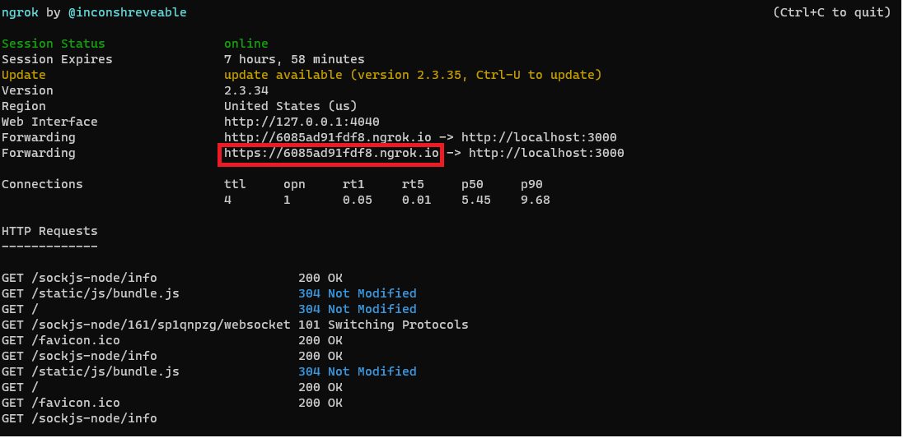

<!-- omit in toc -->
# Local development experience

## Ngrok to the rescue!

In order to simplify the development of the addon, we are supporting a flow where a developer will run addon client or server locally on his own computer but still be able to test it integrated on the Outreach site.

In order to do that, developer needs to download a tool called [ngrok](https://ngrok.com/). NGrok is available for every OS, it has a free version and it requires no instalation on a compuer.

Once ngrok is installed and unpacked to a folder it is being run by simple

```json
./ngrok http 3000
```

Result of this command will be next screen containing ngrok publicly available endpoint




This means that a secure tunnel from a publicly available endpoint will be forwarded to  laptop local host on port 3000 and that enables developing addon work on your computer without the need for deploying  anything which increases developer efficiency and happines.

## Client  addon development

One of the easiest way to work locally on your addon is to simply create a separate dev manifest which will have a few settings pointing to created ngrok public address

```json 
{
    ...
    host: {
        url: 'https://6085ad91fdf8.ngrok.io/addon'
        ...
    },
}
```

The addon will be loaded from a public ngrok host address which will forward traffic to localhost:3000 runing on a local computer. 

## Host authentication support

If you want to develop [addon host authentication support](host.md) you need to configure Outreach app auhentication to redirect to your local server so yo can test auth flow localy.

The first step is the same, create a new dev manifest but this time it would have to have the api section with token value pointing to a ngrok public url.

```json 
{
    ...
    host: {
        url: 'https://6085ad91fdf8.ngrok.io/addon'
        ...
    },
    api: {
        url: 'https://6085ad91fdf8.ngrok.io/token'
        ...
    },
}
```

Once this manifest is uploaded to Outreach, go to Outreach app settings and click "Manage OAuth Applications"


Add to the list of valid redirect uri addresses, ngrok public address


Click **Save** and the redirect flow will then be allowed to go to ngrok public address which will be forwarded to your local host and you can then work on addon host server localy.
