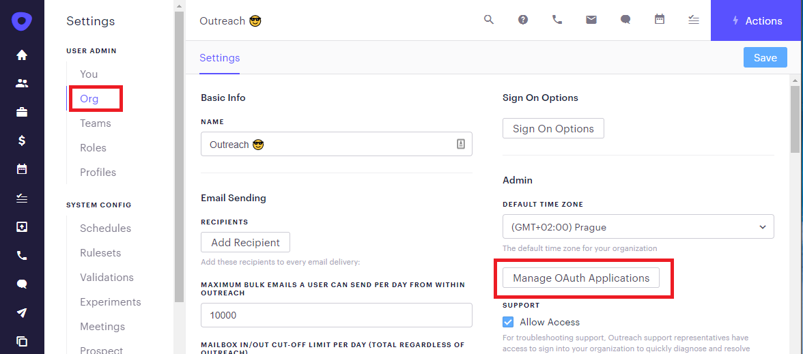

<!-- omit in toc -->
# Local development experience

## Ngrok to the rescue

To simplify the addon's development, we are supporting a flow where a developer will run the addon client or server locally on his computer but still test it integrated on the Outreach site.

To do that, the developer needs to download a tool called [ngrok](https://ngrok.com/). NGrok is available for every OS, it has a free version, and it requires no installation on a computer.

Once ngrok is installed and unpacked to a folder, it is being run by:

```bash
./ngrok http 3000
```

The result of this command will be the next screen containing ngrok publicly available endpoints.


A secure tunnel from a publicly available endpoint will be established with the laptop localhost on port 3000, so all the traffic to the public endpoint will be forwarded to the localhost. That enables developing addon work on your computer without deploying anything, which increases developer efficiency and happiness.

## Client  addon development

One of the easiest ways to work locally on your addon is to simply create a separate dev manifest, which will have a few settings pointing to created ngrok public addresses.

```bash
{
    ...
    host: {
        url: 'https://6085ad91fdf8.ngrok.io/addon'
        ...
    },
}
```

The addon will be loaded from a public ngrok host address, which will forward traffic to localhost:3000 running on a local computer.

## Host authentication support

If you want to develop addon using [Outreach API access](outreach-api.md), you need to configure Outreach app authentication to redirect to your local server so you can test the auth flow locally.

The first step is the same, create a new dev manifest, but this time it would have to have the API section with the token value pointing to a ngrok public URL.

```bash
{
    ...
    host: {
        url: 'https://6085ad91fdf8.ngrok.io/addon'
        ...
    },
    api: {
        url: 'https://6085ad91fdf8.ngrok.io/token'
        ...
    },
}
```

Once this manifest is uploaded to Outreach, go to Outreach app settings and click "Manage OAuth Applications."



Add to the list of valid redirect URI addresses, ngrok public address.


Click **Save**, and the redirect flow will then be allowed to go to ngrok public address, which will be forwarded to your localhost, and you can then work on the addon host server locally.
