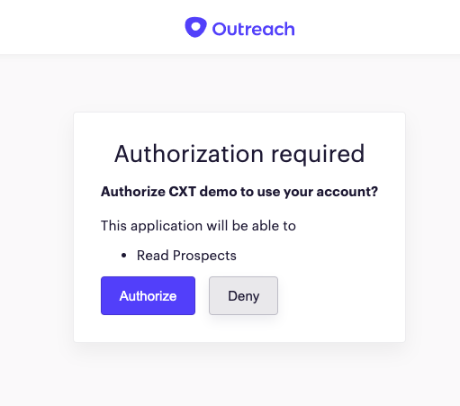

<!-- omit in toc -->
# Addon host
If an addon is not a stateless addon (e.g., calculator), it will need toimplement the [query parameters parsing](#query-parameters-parsing). 

If the add-on would need Outreach API access, it will need to implement [Outreach API access support](#outreach-api-access-support)

**Table of content**

- [Query parameters parsing](#query-parameters-parsing)
  - [200 (OK)](#200-ok)
  - [302 (FOUND)](#302-found)
  - [404 (NOT FOUND)](#404-not-found)
- [Outreach API access support](#outreach-api-access-support)
  - [Define required  scopes](#define-required-scopes)
  - [Setup Outreach OAuth application](#setup-outreach-oauth-application)
  - [Initial authentication flow](#initial-authentication-flow)
    - [User consent](#user-consent)
    - [Obtain access and refresh token](#obtain-access-and-refresh-token)
    - [Caching the tokens](#caching-the-tokens)
    - [Passing back access token](#passing-back-access-token)
  - [Refresh token flow](#refresh-token-flow)


## Query parameters parsing

Any time when the Outreach app loads an addon, it will set as iframe soruice an URL created out of:

- host.URL value [defined in the manifest](manifest.md#url)
- query parameters representing [context values of current Outreach user](manifest.md#context) also defined in the manifest (e.g. "opp.id")
- query params which are always sent regardless of the manifest:
  - locale='en', 
  - theme='light'
  - uid={usr.id} 

That's how the resulting URL which Outreach will set as a source of iframe will be something like this:

```http
    https://addon-host.com/something?locale=en&uid=a1234&opp.id=123456
```

When the add-on loading request comes, the add-on has to parse out of request query parameter values and based on them to return some of the next responses: 200, 302, and 404.

### 200 (OK)

In case when received parameters are sufficient for the add-on to initialize itself into a state matching the given Outreach context, the add-on should just return back initialized page as **200 (OK)** response containing the add-on page content to be rendered in iframe.

### 302 (FOUND)
In case when host URL [defined in the manifest](manifest.md#url) needs to be transformed to some other URL, the add-on hosting page should implement the logic which will determine a new URL based on the received context. That new URL is then being returned as a response with **302 (FOUND)** status code to the iframe, which will then update itself and show the content of that new URL automatically.

### 404 (NOT FOUND)
In case the add-on determines that, with a received set of parameters, there is nothing to be shown in the Outreach app, it will just return **404 (NOT FOUND)** response, and the Outreach app will hide the add-on in that case. 
An alternative to this "do not show add-on" approach, we recommend, is to create a landing page that will offer the creation of the new add-on resources so the user will be onboarded with that. 

## Outreach API access support

If an add-on needs to make an impersonalized call to Outreach API  in the context of the current Outreach user, the add-on host needs to implement authentication support features described here.

**How Outreach API access works?**

All [Outreach API](https://api.outreach.io/api/v2/docs#authentication) requests must be authenticated with a token in the request's HTTP Authorization header.

To enable obtaining of that token, Outreach API supports OAuth flow where the Outreach user needs to consent for giving API access rights with the [scopes](scopes.md) defined in the add-on manifest. 



Once a user consent to that and authorize Outreach API access, [initial authentication flow](#initial-authentication-flow) will start.

A request to the endpoint defined in [redirectUri](host.md#redirectUri) will be made with a **"code"** query parameter value sent from Outreach authentication server. This code is a short-lived authorization token which is used with [Outreach application](manifest.md#applicationId) and [Outreach OAuth app secret](outreach-oauth-settings.md) so a proper Outreach API access tokenand refresh tokens could be obtained.

The addon host will cache the retrieved tokens so the next time user needs to obtain fresjh Outreach API accees token it doesn't have to go again through the consent flow.

There are a few steps add-on host needs to implement in order to support Outreach API access:
- [Define required scopes](#define-required-scopes)
- [Setup Outreach Oauth application](#setup-outreach-oauth-application)
- [Initial authentication flow](#initial-authentication-flow)

### Define required  scopes

First step is identifying what access of the Outreach API you will need and produce a list of the scopes which you will need to achieve that.
You can pick any number of the scopes from the list of supported [API scopes](#scopes) and they will also be presented to the Outreach user on the first APi request addon will make. Outreach will need to provide the  consent with add-on having those permissions on Outreach API when performing requests in his name.

We recommend defining as few as possible and with as less rights you can as that will increase the percentage of Outreach users willing to agree with giving this rights so make sure you require minimal number of scopes you can.

Requesting to a Outreach user to consent with granting rights to a long list of scopes could be less effective then asking them to consent for just a few. Also asking Outreach user to consent on giving **Read-Only** access to a certain API is likely going to be accepted by more users then a request for Read/Write/Delete operations.

The list of manifest scopes will be review also as a part of the Outreach add-on review process and you may be asked to explain why you need some of them for your addon functionality.

### Setup Outreach OAuth application

You will need to create a dedicated Outreach OAuth application for your add-on, and to achieve that, please contact platform@outreach.io for assistance.

With that add-on OAuth application created, you will have:

- application identifier
- application secret
- redirect URI

_The redirect URI can be the same as the add-on host URL defined in the manifest or a dedicated url._


You can see this data on [Outreach app settings page](outreach-oauth-settings.md).

### Initial authentication flow
Before addon performs the first Outreach API call for a new Outreach user it has to perform initial authentication flow which consist of 4 steps:
- Generate authorization code through [user consent](#user-consent)
- [Obtain access and refresh token](#obtain-access-and-refresh-token) from authorization code
- [Caching the tokens](#caching-the-tokens)
- [Passing back access token](#passing-back-access-token)

#### User consent

When an addon needs to perform a first call to an Outreach API, it needs to obtain a fresh access token to use in that call and that is beedn done by calling the [addonSdk.getToken()](#obtaining-an-access-token) function.

As this is the initial call, Outreach user never agreed with granting access to the Outreach API so he will see OAuth popup where he will be asked to approve access with requested scopes.


Once a user consents on this screen by clicking **Authorize**, the request will be made to the address defined in the [manifest api.redirectUri](manifest.md#redirectUri)with a single additional parameter **"code"** containing short-lived authorization token which should be parsed out of the query parameter and used in obtaining the access and refresh tokens.

#### Obtain access and refresh token

As described in [Outreach API documentation](https://api.outreach.io/api/v2/docs#authentication), the add-on host uses authorization code together with [application id and the application secret](#setup-outreach-oauth-application) to obtain access and refresh tokens

**Request**

```http
curl https://api.outreach.io/oauth/token
  -X POST
  -d client_id=<Application_Identifier>
  -d client_secret=<Application_Secret>
  -d redirect_uri=<Application_Redirect_URI>
  -d grant_type=authorization_code
  -d code=<Authorization_Code>
  ```

**Response** will contain all the data needed for accessing the token.

```json
{
  "access_token": <Access_Token>,
  "token_type": "bearer",
  "expires_in": 7200,
  "refresh_token": <Refresh_Token>,
  "scope": <Scope1+Scope2+Scope3>,
  "created_at": 1503301100
}
```

#### Caching the tokens

Now when the add-on host has obtained this data, it needs to store somewhere access and refresh tokens of this user, so later, when the user loads add-on again, it could generate a new access token without forcing the user to go through [user consent](#user-consent) phase.

In order to implement the caching, the add-on host needs to know what is the Outreach user for whom this tokens shold be cached for to be used at the later time. 

In order to support that and considering that [manifest api.redirectUri](manifest.md#redirectUri) can not contain parameters, Outreach addons SDK stored in a ["cxt-sdk-user" cookie](sdk.md#auth-user-cookie) at the start of authentication user identifier of the current Outreach user.

Addon host implementing the caching should now read that cookie value and use it as a cache key for storing retrieved refresh and access tokens.
d.

#### Passing back access token

Now when the add-on host obtained the access token and cached the refresh token, it needs to send the token back the add-on, so the add-on can perform Outreach API calls using that token.

In order to do that, the add-on host has to respond to the original request, with a [302 Found](https://developer.mozilla.org/en-US/docs/Web/HTTP/Status/302) status code with the [Location header](https://developer.mozilla.org/en-US/docs/Web/HTTP/Headers/Location) with value defined like this
 
 ``` http
 {REQUEST_URL} + "&token=<ACCESS_TOKEN>&expiresAt=<EXPIRES_AT>"
```

- REQUEST_URL - it is the complete URL of the request to add-on host
- ACCESS_TOKEN - it is the value of the access token retrieved from the Outreach API
- EXPIRES_AT - it is the value of expiration of the access token retrieved from Outreach API

### Refresh token flow

As described in [manifest host.auth endpoint](#auth-endpoint) section, if add-on wants to support Outreach API access it has to implement additional endpoint which will support refresh token flow. The purpose of this endpoint is to be used as API endpoint which will return only a new token info if possible without any content etc.

When called, this endpoint will be called with a UID query parameter containing a unique user id value (same one as used in [caching the tokens](#caching-the-tokens) section) and endpoint implementation has to check if it has previously cached tokens for that given user id.

If there is a cached **access token** and it still didn't expire, the add-on host should just return back the 200 OK result with payload containing token and expirationAt values.

If there is a cached **refresh token**, it will use that refresh token to obtain a new version of the application token as described in [Outreach API documentation](https://api.outreach.io/api/v2/docs#authentication)

Request (with a refresh token, application id, and secret)

```http
curl https://api.outreach.io/oauth/token
  -X POST
  -d client_id=<Application_Identifier>
  -d client_secret=<Application_Secret>
  -d redirect_uri=<Application_Redirect_URI>
  -d grant_type=refresh_token
  -d refresh_token=<Refresh_Token>
```

Response

```json
{
  "access_token": <Access_Token>,
  "token_type": "bearer",
  "expires_in": 7200,
  "refresh_token": <Refresh_Token>,
  "scope": <Scope1+Scope2+Scope3>,
  "created_at": 1503308300
}
```

Once this is received, the add-on host should [cache the tokens](#caching-the-tokens) and then just return back the **200 (OK)** result with payload containing token and expirationAt values.

In case add-on host is not having any cached token information and thus it can not obtain access token, it will return **404 (NOT FOUND)** status code.