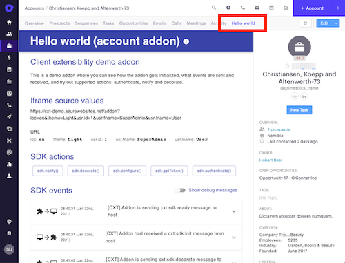
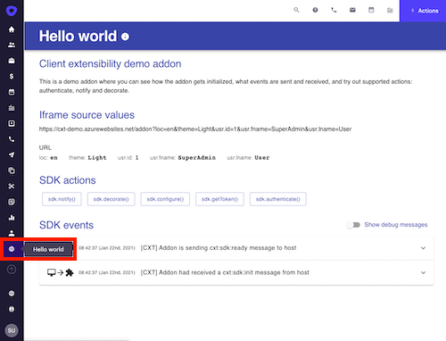

<!-- omit in toc -->

# Manifest file

Table of content:

- [Manifest file](#manifest-file)
  - [Sample manifest](#sample-manifest)
  - [Manifest JSON schema](#manifest-json-schema)
  - [Basic manifest properties](#basic-manifest-properties)
    - [identifier](#identifier)
    - [version](#version)
    - [store](#store)
    - [title](#title)
    - [description](#description)
    - [categories](#categories)
    - [host](#host)
      - [type](#type)
      - [url](#url)
      - [icon](#icon)
      - [environment](#environment)
    - [author](#author)
  - [Integration manifest properties](#integration-manifest-properties)
    - [context](#context)
  - [configuration](#configuration)
  - [api (optional)](#api-optional)
    - [applicationId](#applicationid)
    - [redirectUri](#redirecturi)
    - [scopes](#scopes)
    - [token](#token)
    - [connect](#connect)
  - [Uploading the manifest](#uploading-the-manifest)

Manifest is a simple JSON file that the addon developer uploads to Outreach and which contains all of the data needed for Outreach to host addon in an iframe.

All of the manifest properties are grouped in a few groups:

- **Basic properties** (name, description, author info, etc.)
- **Host section** (where is addon page located and where it should be hosted in Outreach app)
- **Context section** (what contextual info should Outreach send during the addon initialization)
- **API section** - optional (what scopes addon needs for accessing Outreach API)
- **Configuration section** - optional (what values we should collect from an Outreach user installing the addon.

## Sample manifest

Here is the sample manifest file of the hello world addon

```json
{
  "version": "0.10",
  "identifier": "addon-outreach-hello",
  "store": "public",
  "title": {
    "en": "Hello world",
    "fr": "Salut tout le monde"
  },
  "description": {
    "en": "This is a sample addon created as a guide for Outreach addon creators",
    "fr": "Il s’agit d’un addon échantillon créé comme un guide pour les créateurs addon Outreach"
  },
  "host": {
    "type": "tab-opportunity",
    "url": "https://addon-host.com/something",
    "icon": "https://addon-host.com/icon.png",
    "environment": {
      "fullWidth": true,
      "decoration": "simple"
    }
  },
  "author": {
    "company": "Contoso Ltd",
    "websiteUrl": "https://addon-host.com/",
    "privacyUrl": "https://addon-host.com/privacy",
    "termsOfUseUrl": "https://addon-host.com/tos"
  },
  "categories" : [
    "sales_productivity",
    "marketing"
  ],
  "context": [
    "usr.id",
    "opp.id",
    "pro.id"
  ],
  "api": {
    "token": "https://addon-host.com/token",
    "scopes": [
      "prospects.read",
      "opportunities.read"
    ],
    "applicationId": "AbCd123456qW",
    "redirectUri": "https://addon-host.com/hello-world",
    "connect": "https://addon-host.com/connect"
  },
  "configuration": [{
      "key": "project", "type": "string",
      "required": true, "urlInclude": true,
      "text": {
        "en": "Project name."
      }
  }]
}
```

**Additional info**

- List of all of the supported context properties, go to [context property page](context.md)

- List of all of the API scopes can be found on [API Scopes page](scopes.md).

## Manifest JSON schema

Internally we validate each submitted manifest using the following schema
[Manifest JSON schema v1.0](schema/1.0/manifest.schema.json)

A manifest can be validated using the [online tool](https://www.jsonschemavalidator.net/)

## Basic manifest properties

### identifier

Unique identifier of the addon as defined by the addon creator

### version

A version of addon manifest in the format MAJOR.MINOR

### store

Defines the store in which addon will be served:

- **Public**

  The addon is going to be available in the addon store to all of the Outreach users.

- **Private**

The addon is going to be available only internally for users of a company that created the addon.

- **Personal**

  The addon is going to be available only to a developer who uploaded the manifest.

### title

The localized addon title is shown in the addon store and Outreach app as a tab tile.

### description

A localized addon description is shown in the addon store to explain what the addon does and why someone would want to install it.

### categories

A collection of one or more categories to which the addon belongs.
It is used to enable Outreach customers finding the best extension fulfilling their needs.

### host

#### type

Outreach application supports different types of addons, which can be loaded in different parts of the application.
Type property defines what the type of addon is and where it should be loaded.

_, e.g., **type: "tab-opportunity"** will result with addon being loaded as an additional tab on the Outreach opportunity page_

[SDK supported addon types](../src/store/AddonType.ts) (we will expand this list as time goes):

- tab-account
- tab-opportunity
- tab-prospect
- left-side-menu

 

#### url

Address where the addon hosting web page is hosted.

This URL can be a direct URL without any value placeholders, in which case the Outreach host will add all of the contextual parameters as query parameters.

e.g.

```javascript
manifest.host.url = "http://somesite.com/something";
manifest.context = ["opp.id", "usr.id"];
```

In the case of an Outreach user with id 456 looking at opportunity 123, this will result during the runtime.

```bash
 http://somesite.com/something?opp.id=123&usr.id=456
```

In addition to this default behavior, the addon creator can customize how the addon URL is constructed by applying simple templatization.

e.g.

```javascript
manifest.host.url = "http://somesite.com/something/{usr.id}";
```

will become during the runtime

```bash
http://somesite.com/something/456?opp.id=123
```

_NB: as opp.id was not tokenized, it was appended as query parameter following the default naming convention_

The addon creator can templatize the name of the query parameters.

e.g.

```javascript
manifest.host.url = "http://somesite.com/something/{usr.id}?oid={opp.id}";
```

will become during the runtime

```bash
http://somesite.com/something/456?oid=123
```

#### icon

base64 string represents the icon to be shown in the addon store and (if possible) in the Outreach client.

#### environment

This is the optional section where the addon creator can express expectations the Outreach host environment has to match for the addon to function correctly.

e.g., to remove right pane and show addon tab using whole page width

```javascript
manifest.host.environment = {
  fullWidth: true
}
```

e.g., to show a addon icon badge decoration

```javascript
manifest.host.environment = {
  decoration: 'simple'
}
```

### author

This section contains information to be presented to a user of the addon in the marketplace and on the consent screen: addon creator name, website URL, privacy policy document URL, and terms of use document URL.

## Integration manifest properties

### context

In this section, the addon author defines a list of predefined context information that addon needs from Outreach to be sent during the initialization process.
It is a string array of predefined Outreach properties describing attributes of the Outreach user loading the addon.

e.g. ["opp.id", "acc.id"]

Outreach Users will be asked to consent to share this information before the addon is installed from the addon store.
In case addon is installed by admin for other users, admin is the one consenting to share the defined context properties for all the org users he is installing it for.

To learn more about the list of all of the supported context properties, go to [context property page](context.md).

## configuration

This section is optional.
If the addon doesn't need a user-specific runtime configuration, this section can be omitted.

In this section, the addon creator defines what information should collect from the user and pass it to the addon as a part of the initialization process.

To learn more about configuration section, go to [manifest configuration page](configuration.md)

## api (optional)

This section is optional.
If the addon doesn't need access to outreach API, this section can be omitted.

### applicationId

This is the value of the [Outreach OAuth application](outreach-OAuth-settings.md), which is to be used for [API authentication flow](https://api.outreach.io/api/v2/docs#authentication)as client_id value.

### redirectUri

This URL is defined in [Outreach OAuth settings](outreach-oauth-settings.md), to which the authorization form will redirect once the user consent with granting access to Outreach API in his name. This URL can be the same as the [host url](#url) or a separate URL, but in both cases, it has to be implemented in a way matching [Outreach API access requirements](outreach-api.md).

### scopes

In the scopes section, the addon creator defines Outreach API scopes that are needed for performing API calls addon needs to perform.

A complete list of all of the API scopes can be found on [API Scopes page](scopes.md).

On the first [SDK authentication](sdk.md#authentication) Outreach, the user is asked to consent to grant requested scopes to the addon


### token

This value contains URL of the [token endpoint](outreach-api.md#token-endpoint)

### connect

This value contains URL of the [token endpoint](outreach-api.md#connect-endpoint).
Note: The domain of the connect uri has to be the same as the domain of the [host.url](#url)

## Uploading the manifest

Once the manifest file is created, it has to be uploaded to Outreach so it can be tested and optimized in the Outreach app.

At the moment, there are two ways you can upload the manifest:
emailing it support email cxt-sdk@outreach.io or by using the Outreach API to POST manifest file.
