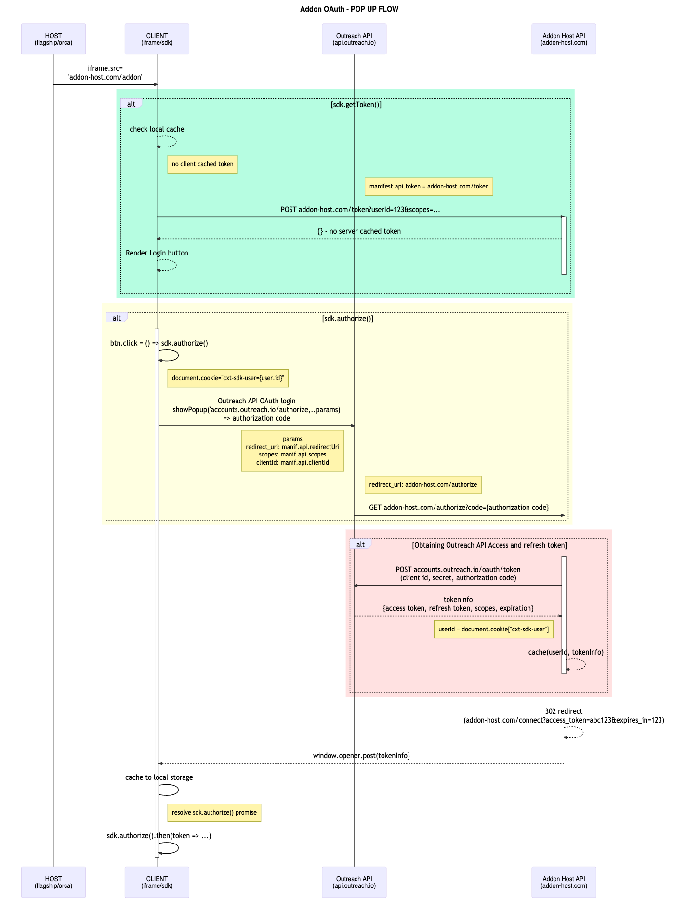

<!-- omit in toc -->
# Outreach API access support

- [How Outreach API access works](#how-outreach-api-access-works)
- [OAuth sequence diagram](#oauth-sequence-diagram)
- [Prerequisites](#prerequisites)
  - [Define required scopes](#define-required-scopes)
  - [Setup Outreach OAuth application](#setup-outreach-oauth-application)
- [Token endpoint](#token-endpoint)
- [Outreach API consent](#outreach-api-consent)
- [Authorization endpoint](#authorization-endpoint)
  - [Obtain access and refresh token](#obtain-access-and-refresh-token)
  - [Caching the tokens](#caching-the-tokens)
    - [Customizing the sdk user cookie](#customizing-the-sdk-user-cookie)
  - [Passing back access token](#passing-back-access-token)
  - [Connect endpoint](#connect-endpoint)

Suppose an add-on needs to make an impersonalized call to Outreach API  in the current Outreach user context. In that case, the add-on creator needs to implement an authentication host, which is a server publicly accessible on the internet with a few required endpoints.

## How Outreach API access works

All [Outreach API](https://api.outreach.io/api/v2/docs#authentication) requests must be authenticated with a token in the request's HTTP Authorization header.

To enable obtaining that token, Outreach API supports OAuth flow where the Outreach user needs to consent for giving API access rights with the [scopes](scopes.md) defined in the add-on manifest.


Once a user consent to that and authorize Outreach API access, [initial authentication flow](#initial-authentication-flow) will start.

A request to the endpoint defined in [redirectUri](outreach-api.md#redirectUri) will be made with a **"code"** query parameter value sent from Outreach authentication server. This code is a short-lived authorization token, which is used with [Outreach application](manifest.md#applicationId) and [Outreach OAuth app secret](outreach-OAuth-settings.md) so a proper Outreach API access token and refresh tokens could be obtained.

The add-on host will cache the retrieved tokens, so the next time user needs to obtain a new Outreach API access token, it doesn't have to go again through the consent flow.

## OAuth sequence diagram



As you can tell from the sequence diagram, there are a few steps "Add-on host API" needs to implement to support Outreach API access:

1. When the add-on loads, the add-on will call **sdk.getToken()** to see if there is an Outreach API access token available from the previous session
   - Check the browser local storage for a valid token
   - Call the  [token endpoint](#token-endpoint) with the current user id parameter, which returns user access token out of a valid cached access token or using the previously obtained refresh token.
2. If no token available, addon renders a "Login with Outreach" button and in click handler of that button invokes **sdk.authorize()** function
   - It will create a "cxt-sdk-user" cookie which will hold session state(userId) needed in next authorization step
   - Addon opens popup using the Outreach [API authentication URL](https://api.outreach.io/api/v2/docs#authentication). Constructing of this url relies on manifest.api section configuration: [applicationId](manifest.md#applicationid), [redirectUri](manifest.md#redirecturi) and [scopes](manifest.md#scopes) values.
   - When user clicks **Authorize** button on [Outreach consent screen](assets/api-consent.png), Outreach will redirect to  **/authorize** endpoint on ([manifest.api.redirectUri](manifest.md#redirecturi)) address with a short living authorization code passed as query param.

3. Host **authorize endpoint** will then:
   - read the session context from request cookie "cxt-sdk-user": userId.
   - use received authorization code with Outreach app id and the secret to obtaining Outreach API access and refresh token
   - cache the retrieved tokens using a cache key with session userId value read from the cookie.
   - redirect to connect endpoint with access token and expiration passed as a query parameter
  
4. Host **connect endpoint** then:
   - Read the token value and expiration from query params
   - Sends POST message to the add-on window, which opens the popup
   - Close itself

5. Post message is then:
   - received on add-on page by SDK
   - token is locally cached in local storage
   - sdk.authorize() promise is resolved with the access token value

## Prerequisites

In order for all these steps to be implemented there are certain things add-on creator has to do in preparation for their implementation:

- [Define required scopes](#define-required-scopes)
- [Setup Outreach OAuth application](#setup-outreach-OAuth-application)

### Define required scopes

The first step is to identify what access to the Outreach API you will need and produce a list of the scopes you will need to achieve.
You can pick any number of the scopes from the list of supported [API scopes](#scopes), and they will also be presented to the Outreach user on the first API request add-on will make. Outreach will need to provide the consent with add-on having those permissions on Outreach API when performing requests in his name.

We recommend defining as few as possible and with as few rights possible as that will increase the percentage of Outreach users willing to agree with giving these rights, so make sure you require a minimal number of scopes you can.

Requesting an Outreach user to consent with granting rights to a long list of scopes could be less effective than asking them to approve for just a few. Also, asking Outreach users to agree on giving **Read-Only** access to a specific API will likely be accepted by more users than a request for Read/Write/Delete operations.

The Outreach add-on review process includes reviewing the list of manifest scopes to ensure that add-on requests access the optimal set of scopes is acceptable to the largest number of Outreach users.

### Setup Outreach OAuth application

You will need to create a dedicated Outreach OAuth application for your add-on and to achieve that, please contact platform@outreach.io for assistance.

With that add-on OAuth application created, you will have:

- application identifier
- application secret
- redirect URI

_The redirect URI can be the same as the add-on host URL defined in the manifest or a dedicated URL._

You can learn more about how to set up this on the [Outreach app settings page](outreach-OAuth-settings.md).

## Token endpoint

The token endpoint's primary purpose is to provide an access token for the user after he consented to grant required permissions to add-on.

To do that token endpoint:

- Maintains a local cache of the user tokens
- Refreshes an expired access token

When a POST request comes to this endpoint in its body will contain the userId value, which will be used to determine the caching key (as described in [caching the tokens](#caching-the-tokens) section).

In case the add-on host does not have any cached token information, it can not obtain an access token, and it will return **404 (NOT FOUND)** status code.

In case retrieved cached **access token** is still valid, the token endpoint will return the 200 OK results with a payload containing {token, expiresAt} values.

In case the retrieved access token had expired, the connect endpoint will use the cached refresh token to obtain a new version of the application token as described in [Outreach API documentation](https://api.outreach.io/api/v2/docs#authentication).

Request (with a refresh token, application id, and secret)

```http
curl https://api.outreach.io/oauth/token
  -X POST
  -d client_id=<Application_Identifier>
  -d client_secret=<Application_Secret>
  -d redirect_uri=<Application_Redirect_URI>
  -d grant_type=refresh_token
  -d refresh_token=<Refresh_Token>
```

Response

```json
{
  "access_token": <Access_Token>,
  "token_type": "bearer",
  "expires_in": 7200,
  "refresh_token": <Refresh_Token>,
  "scope": <Scope1+Scope2+Scope3>,
  "created_at": 1503308300
}

```

Once a new Outreach API access token is received, the add-on host will:

- update the cached information (as described in [cache the tokens](#caching-the-tokens) section)
- return the **200 (OK)** result with a payload containing token and expiration values.

## Outreach API consent

When an add-on needs to perform the first call to an Outreach API, it needs to obtain consent from an Outreach user for the add-on to access Outreach API in that user's name.

That is being done by simply calling the [authorize()](../src/index.ts#L209)

```javascript
var token = await addonSdk.authorize();
```

The Outreach user will see an OAuth popup where he will be asked to approve access with [scopes defined in manifest](manifest.md#scopes).


Once a user consents on this screen by clicking **Authorize**, Outreach will request the address defined in the [manifest api.redirectUri](manifest.md#redirectUri) with a single additional parameter **"code"**. This parameter will contain a short-lived authorization token that should be parsed out of the query parameter and used to obtain the access and refresh tokens.

## Authorization endpoint

### Obtain access and refresh token

As described in [Outreach API documentation](https://api.outreach.io/api/v2/docs#authentication), the add-on host uses authorization code together with [application id and the application secret](#setup-outreach-OAuth-application) to obtain access and refresh tokens

**Request**

```http
curl https://api.outreach.io/oauth/token
  -X POST
  -d client_id=<Application_Identifier>
  -d client_secret=<Application_Secret>
  -d redirect_uri=<Application_Redirect_URI>
  -d grant_type=authorization_code
  -d code=<Authorization_Code>
  ```

**Response** will contain all the data needed for accessing the token.

```json
{
  "access_token": <Access_Token>,
  "token_type": "bearer",
  "expires_in": 7200,
  "refresh_token": <Refresh_Token>,
  "scope": <Scope1+Scope2+Scope3>,
  "created_at": 1503301100
}
```

### Caching the tokens

When the add-on host has obtained this data, it needs to store access and refresh tokens of this user. Later, when the user loads the add-on again, it could generate a new access token through the [token endpoint](#token-endpoint) implementation.

The add-on host needs to know the Outreach user for whom these tokens should be cached to be used later to implement the caching.

Considering that [manifest api.redirectUri](manifest.md#redirectUri) can not contain state parameters, Outreach addons SDK stores current Outreach user identifier in **"cxt-sdk-user"** cookie at the start of sdk.authorize() implementation.

The add-on host implementing the caching should read from the cookie userId value and use it as a cache key for storing retrieved refresh and access tokens.

#### Customizing the sdk user cookie

The cxt-sdk-user cookie works because it is created on the domain where the addon is stored (e.g., "addon.some-host.com") through standard browser behavior, is sent to the api if the api endpoint is hosted on the same domain.
Sometimes, the API is hosted in a different domain (e.g., "api.some-host.com"), and cookies sent on the addon domain will not be sent so that the OAuth flow will fail to [cache credentials](#caching-the-tokens).

CXT sdk exposes a way to customize the domain to be used for context cookie to accommodate this - make sure cookie domain is set to api domain before starting authorization.

``` javascript

sdk.cookie.domain ='.some-host.com';
var token = await sdk.authenticate();
```

In this example, both app.some-host.com and api.some-host.com have access to user cookie through the defined domain.

(You can also change the cookie name (default: 'cxt-sdk-user') and max-age of the cookie (default: 1 hour)

### Passing back access token

Now when the add-on host obtained the access token and cached the refresh token, it needs to send the token back to the add-on, so the add-on can perform Outreach API calls using that token.

To do that, the add-on host has to respond to the original request, with a [302 Found](https://developer.mozilla.org/en-US/docs/Web/HTTP/Status/302) status code with the [Location header](https://developer.mozilla.org/en-US/docs/Web/HTTP/Headers/Location) with the value of [manifest api connect endpoint](./manifest.md#connect)

 ``` http
 {MANIFEST.API.CONNECT} + "&token=<ACCESS_TOKEN>&expiresAt=<EXPIRES_AT>"
```

- MANIFEST.API.CONNECT - it is the connect endpoint URL.
- ACCESS_TOKEN - it is the value of the access token retrieved from the Outreach API
- EXPIRES_AT - it is the value of expiration of the access token retrieved from Outreach API

### Connect endpoint

Connect endpoint is a specific HTML page with a small javascript implementation posting the tokens to the add-on page, which opens the popup and then closes itself.

Here is [mvc core sample implementation](https://github.com/getoutreach/clientxtdocs/blob/master/samples/hello-world/aspnetcore/Views/Connect/Index.cshtml) from our documentation repo (samples in other languages also available)

```html
<html>
<head>
    <title>Outreach login connect page</title>
</head>
<body>
    <script>

      var url = new URL(window.location.href);
      var token = '@Model.Token';
      var expiresAt = '@Model.ExpiresAt';
      var target ='@Model.AddonHostOrigin';

      var data = JSON.stringify({
        type: 'cxt:connect:token',
        token,
        expiresAt
      });

      if (window.opener) {
        window.opener.postMessage(data, target);
      }

      window.close();
    </script>


</body >
</html >
```

The whole point of the code is to POST event with type 'cxt:connect:token' to the add-on page (window.opener) so the add-on can get the new values.
