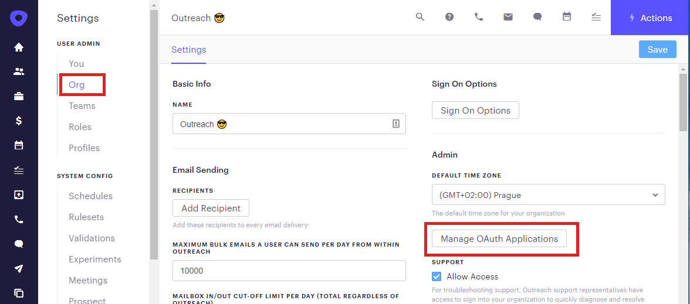
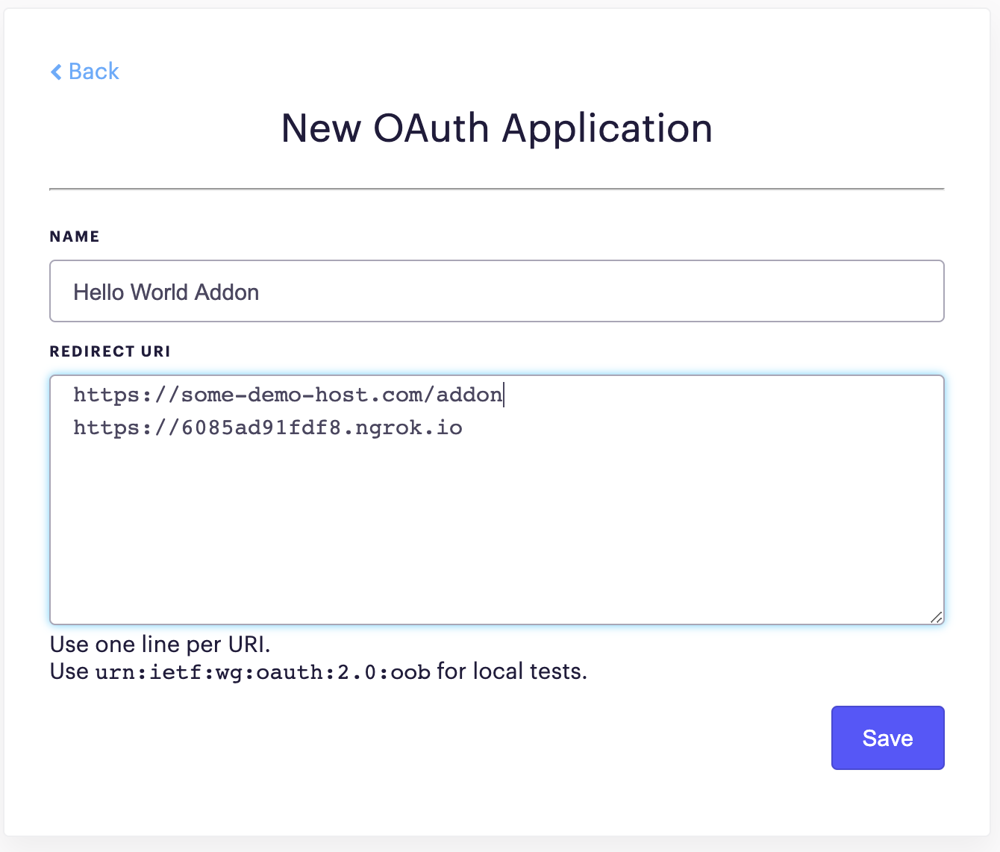
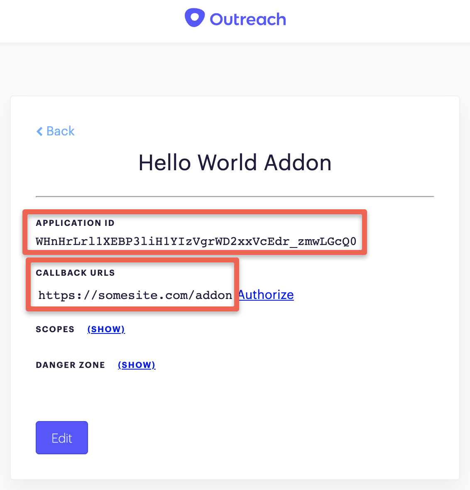

# Outreach application OAuth settings

To manage your Outreach applications, you need to go to Outreach app settings, select Org settings, and click "Manage OAuth Applications."

You can create there a new dedicated OAuth application which you will use for Outreach addon - you need to define the name of the app and one or more valid redirect URLs. 

At any time later, you can view/edit OAuth app settings.

