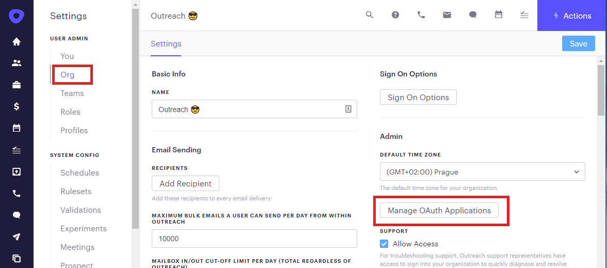
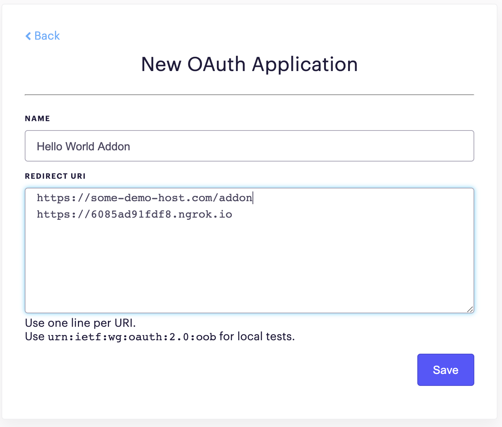

# Outreach application OAuth settings

In order to manage your Outreach applications you need to go to Outreach app settings, select Org settings and click "Manage OAuth Applications."

Add to the list of valid redirect URI addresses, ngrok public address.

Click **Save**, and the redirect flow will then be allowed to go to ngrok public address, which will be forwarded to your localhost, and you can then work on the addon host server locally.
